## Introduction

### Context

Cities around the world are experiencing increasingly severe impacts from climate change ranging from more frequent and intense heatwaves, changing precipitation patterns, and a growing number of extreme weather events that threaten the resilience and livability of urban environments. Historic Urban Landscapes (HULs) face additional pressures due to rapid urbanization and the need to protect and conserve cultural heritage. Rising temperatures, more frequent extreme weather events, and changing hydrological conditions are putting HULs under increasing environmental stress while simultaneously threatening the cultural, spatial and social values that define them [@united_nations_educational_scientific_and_cultural_organization_new_2013; @noauthor_climate_nodate]. Unlike recently developed urban areas, historic city centers have limited opportunities for large scale physical interventions due to the existing urban morphology and protected heritage assets.

Responding to these challenges, the PAST-FORWARD (Preserving & Adapting Spatial Transformations toward Future-Oriented Resilient Development) project, a collaborative initiative between researchers from Netherlands and China, aims to develop climate-adaptive strategies for HULs. By combining geospatial analysis, landscape-based urban design, governance and stakeholder participation, the project aims to translate research into evidence based planning approaches that strengthen urban resilience while safeguarding cultural heritage. Through living laboratories in Delft, Rotterdam, Xi'an and Guangzhou, PAST-FORWARD investigates how climate adaptation strategies can be designed, tested and implemented across different urban and governance contexts.

### Heat in Historic Urban Landscapes

In Historic Urban Landscapes, urban heat has emerged as one of the more pressing concerns. Increasing temperatures and more frequent heatwaves have intensified the Urban Heat Island (UHI) effect where dense environments experience significantly higher temperatures than their surrounding rural areas [@santamouris_recent_2020]. Historic city centers are particularly susceptible to this phenomenon owing to their compact urban form, extensive impervious surfaces, limited existing vegetation and restricted opportunities for introducing large-scale cooling interventions that amplify heat concentration while limiting potential for adaptation measures [@bartesaghi-koc2020; @cai2019]. These altered micro-climate conditions reduce not just the environmental quality of public spaces but also increase human exposure to thermal stress.

The heritage value of historic city centers extends beyond the buildings. They are the living environments where streets, squares and public spaces support everyday movement, social interactions, economic activity and cultural identity. The consequences of UHI alters these everyday experiences of the city and expose residents and tourists to thermal stress during walking, recreation and social activities. Thus climate adaptation measures cannnot only focus on the protection of heritage fabric but must also preserve these qualities such that these spaces remain livable, accessible and socially vibrant. As Lenzholzer argues, urban climate should not be understood as just the meteorological phenomenon but also as something that shapes how people perceive, occupy and use urban space [@lenzholzer2025]. Climate adaptation in historic cities thus requires approaches that integrate environmental performance, heritage conservation and human-centred urban design.

Previous studies have demonstrated that urban morphology, vegetation and water bodies influence local thermal conditions and play vital roles in reducing the urban heat [@bartesaghi-koc2020; @beier2022]. However these environmental characteristics do not exist independently of the ways in which people move and experience the city. Thus, identifying where thermal stress coincides with streets that accommodate high levels of pedestrian movement is therefore essential for prioritizing climate adaptation interventions where they are likely to deliver the greatest public benefit. This challenge provides the basis for the comparative approach adopted in this study.

### Case Selection

This study adopts a comparative case study approach using the historic city centers of Delft (The Netherlands) and Xi'an (China), two participating cities in the PAST-FORWARD living laboratories. While differing considerably in scale (approximately 24.06 km² and 10,097 km², respectively) and climate (mild, temperate maritime and semi-arid continental monsoon respectively), both cities contain well-defined historic cores that function as active centers of movement, tourism and public life. Their cultural significance and ongoing need to adapt to climate change make them representative examples for this study.

The two cities present contrasting urban morphologies as seen in @fig-case-selection. Delft developed as a compact medieval canal city is characterized by a fine-grain street network. On the other hand, Xi'an retains a large orthogonal street network enclosed within its historic city walls. These differences influence their spatial distribution of movement, vegetation and ultimately urban heat, providing an opportunity to examine how similar climate adaptation challenges manifest under contrasting urban conditions.

By analyzing Delft and Xi'an using a common spatial analytical framework, this study investigates whether comparable street typologies and climate adaptation priorities emerge despite their differing physical and climatic conditions. The comparison therefore provides insight into both the context specific characteristics as well as patterns that may be transferable across historic urban landscapes.

::: {#fig-case-selection layout-ncol="2"}
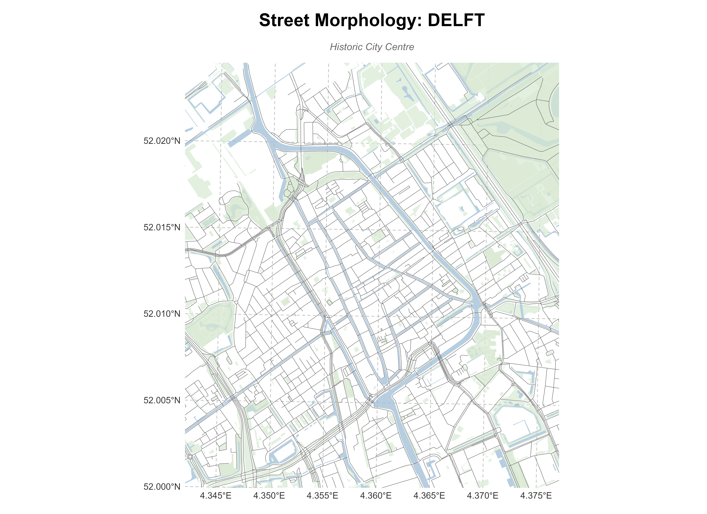{lightbox="choice"}

{lightbox="choice"}

Map showing the Street Morphology of the Cities of Delft (a) and Xi'an (b).
:::

### Research Questions

Existing research has demonstrated how urban morphology, vegetation and water bodies influence local thermal conditions in historic cities along with the potential for using nature-based solutions in improving thermal comfort [@bartesaghi-koc2020; @beier2022]. However, translating this knowledge into spatially explicit decision-support tools that identify where climate adaptation interventions should be prioritized remains a challenge. While many studies focus on evaluating thermal conditions or assessing the effectiveness of individual interventions, comparatively less attention has been given to integrated analytical frameworks that combine thermal stress, pedestrian movement, and access to natural cooling infrastructure to support evidence-based planning, particularly across contrasting historic cities.

To address this gap, this study investigates the historic city centers of Delft and Xi'an through the following research questions:

{#fig-research_ques}

To answer these research questions, each is operationalized into four measurable spatial variables: Movement Potential, representing street network importance through Angular Choice; Land Surface Temperature, capturing thermal conditions; and Distance to Green Space and Distance to Blue Space, characterizing the availability of natural cooling resources. Together, these variables form a reproducible analytical framework that identifies street typologies based on movement, heat exposure, and access to cooling infrastructure. The resulting framework supports the prioritization of pedestrian streets for the implementation of nature-based solutions (NBS), providing an evidence-based approach to optimizing thermal comfort within historic city centers.

{#fig-research_ques_variable}

## Methods

### Analytical Framework

The analytical framework was developed to operationalize the research questions through a reproducible spatial workflow (@fig-analytical_framework). Rather than evaluating thermal conditions in isolation, the framework integrates indicators of street network importance, thermal stress, and access to natural cooling resources to identify pedestrian street typologies and support evidence-based climate adaptation in historic city centers.

{#fig-analytical_framework}

The workflow is organized into six sequential stages: (1) data acquisition, (2) network pre-processing, (3) variable calculation, (4) data aggregation and standardization, (5) clustering and typology construction, and (6) climate adaptation prioritization. This structure translates the research questions into measurable spatial variables, combines them into a consistent analytical framework, and ultimately identifies priority street segments for nature-based interventions. Applying the same workflow to both Delft and Xi'an ensures methodological consistency, enabling a direct comparison of street typologies and climate adaptation priorities across two contrasting historic city centers.

### Data Collection

#### Data Selection Criteria

The datasets used in this study were selected according to two guiding principles: reproducibility and comparability. First, all datasets were obtained from freely available and open-access sources to ensure that the analytic workflow can be reproduced in different study areas without requiring proprietary data. Second, equivalent datasets were selected for both Delft and Xi'an to enable a consistent comparison between the two. Although, higher-resolution datasets are available for Delft, datasets with comparable spatial characteristics were preferred to maintain methodological consistency between the two cases.

Based on these criterias, four datasets were collected to represent the variables of the analytical framework: the pedestrian network, land surface temperature, green spaces and blue spaces. Street network data, green as blue spaces were obtained from OpenStreetMap (OSM) , while land surface temperature was derived from Landsat 8-9 Level-2 imagery. For the LST dataset, the chosen time frame was July of 2025; as July is, on average, the warmest month of the year in both cities.

::::: panel-tabset
## Open Street Maps Data

::: {#fig-osm layout-ncol="2"}
{lightbox="study"}

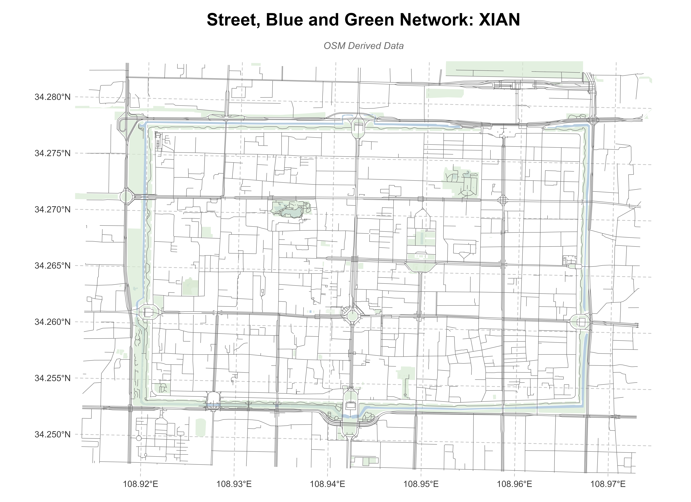{lightbox="study"}

Open Street Map RAW Data for the historic city centres of Delft (a) and Xi'an (b).
:::

## Land Surface Temperature

::: {#fig-lst layout-ncol="2"}
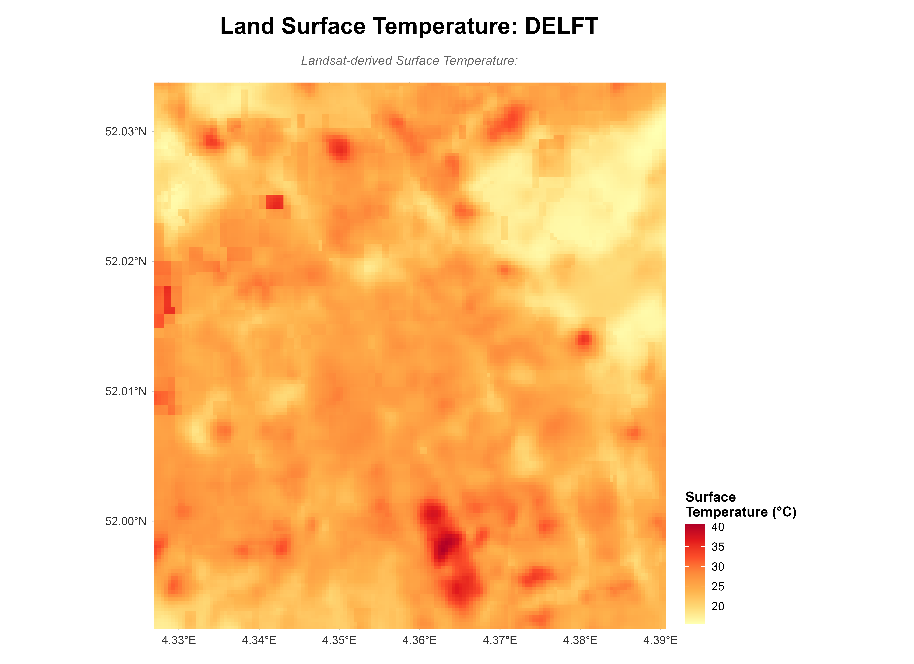{lightbox="study" width="100%"}

**(a) Delft**

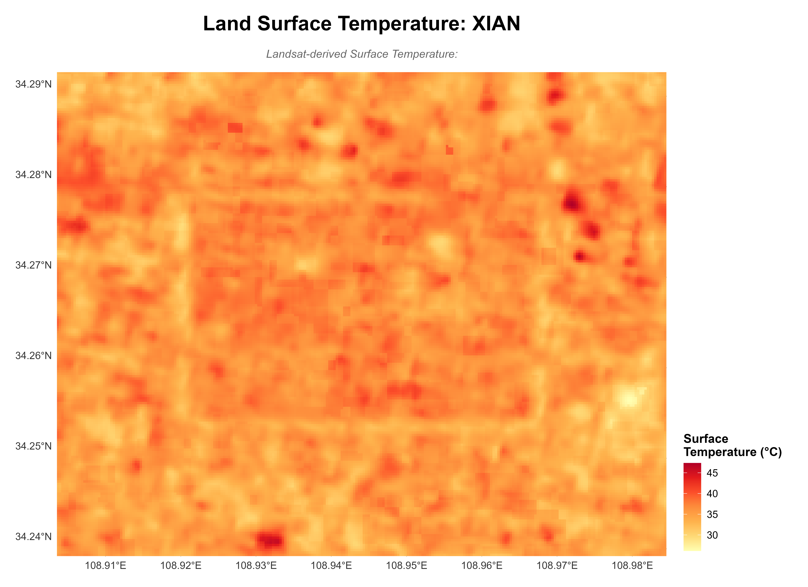{lightbox="study" width="100%"}

**(b) Xi'an**

Landsurface Temperature Data for Delft (a) and Xi'an (b).
:::
:::::

#### Study Area Delimitation

To ensure methodological consistency, the analysis was conducted within a standardized study extent for both Delft and Xi'an. The historic city center was selected as the primary area of analysis, as it represents the focus of this research and contains the highest concentration of pedestrial activity, heritage assets and public spaces. In both cities, the historic urban core is clearly delineated by prominent physical boundaries that distinguish it from the surrounding urban fabric. In Delft, the study area is enclosed by the historic canal ring and adjacent road network, while in Xi'an it is defined by the city walls and surrounding moat. These clearly identifiable urban boundaries enabled consistent delimitation of the historic city centers for comparative analysis.

A 500m buffer was then applied around each historic city center, corresponding to the commonly accepted walking distance in urban planning. This captures the broader pesdestrian catchment of the core, acknowledging that pedestrian movement and environmental processes extend beyond boundaries. The buffer therefore incorporates surrounding green and blue infrastructure that may provide cool benefits, as well as street network connections that influence accessibility and movement into and out of the historic center. Applying the same buffer distance to both case studies ensures a consistent analytical extent while maintaining edge effects during the calculation of variables.

::::: panel-tabset
## Study Area

::: {#fig-study-area layout-ncol="2"}
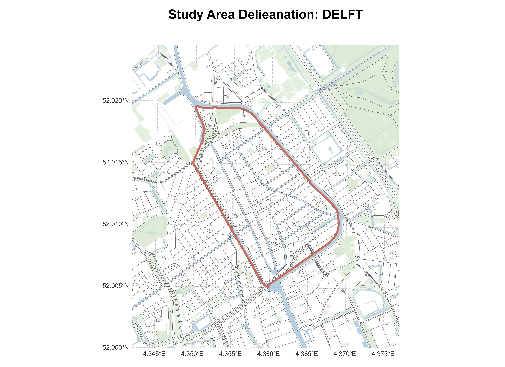{lightbox="study"}

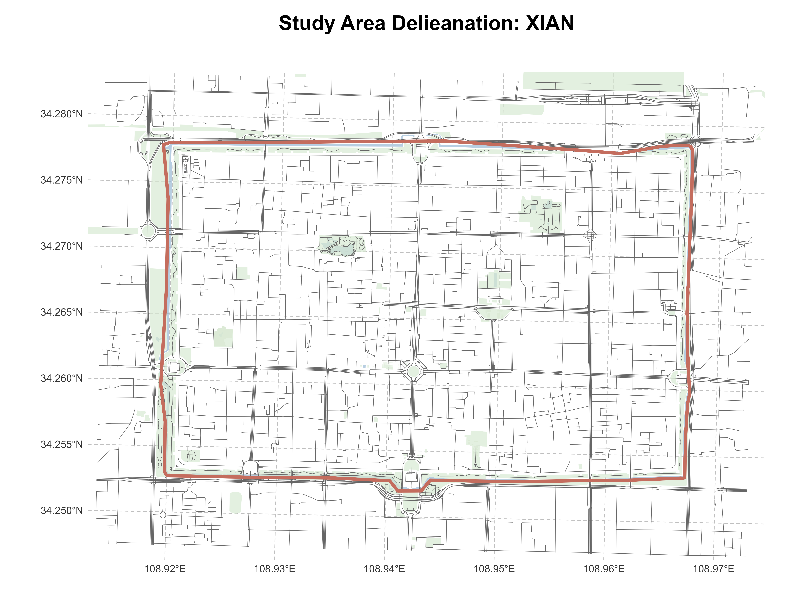{lightbox="study"}

Study area boundaries for the Historic City Centres of Delft (a) and Xi'an (b).
:::

## Study Area Buffer

::: {#fig-study-buffer layout-ncol="2"}
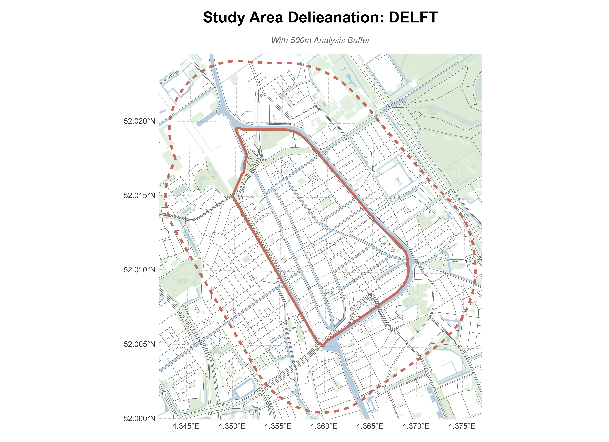{lightbox="study" width="100%"}

**(a) Delft**

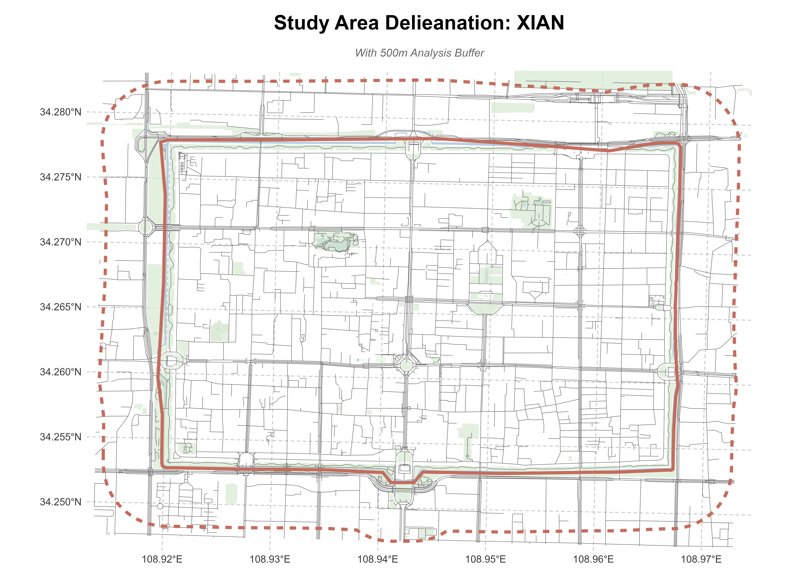{lightbox="study" width="100%"}

**(b) Xi'an**

Historic City Centre boundaries and the 500 m analysis buffer for Delft (a) and Xi'an (b).
:::
:::::

### Network Pre-processing

We selected street segments as our primary analytical unit. Since the administrative boundaries and overall sizes of these two cities are vastly different, comparing them at a city-wide level is difficult. Meanwhile, street segments provide a more consistent baseline for comparison; while street lengths and widths vary across cities, it is observed that this variation is smaller than the gap in their total spatial extents. The initial street data was derived from OpenStreetMap (OSM). As raw OSM data often contains mapping errors, such as duplicates, disconnected lines, and overly fragmented sections, we needed to create a clean dataset. To build continuous segments that closely match how people naturally perceive a single street and better correspond to actual movement conditions, we implemented two steps of preprocessing. Firstly, we simplified the network. The Python package ‘Neatnet’ [@fleischmann2026Adaptive] was used to fix basic topology errors and remove dead-end based on a specific length threshold (25m for Xi’an, 10m for Delft). Nextly, the resulting simplified data was used as an input for the network consolidation process. We used the Python package ‘Momepy’ [@fleischmann_2019], which implements the COINS (Continuity in Street Networks) algorithm [@tripathy2021]. This algorithm evaluates the angles between connecting segments to determine their natural continuity. Based on this natural continuity, smaller fragments are merged into single, continuous paths. As detailed in @tbl-network_comparison, the average length of street segments increased by 42.47% for Delft and 24.66% for Xi'an, respectively. Through this preprocessing, we generated two network data, the simplified network and the consolidated network. The simplified network data used for the subsequent step of variable calculation, while the consolidated network data used for variable aggregation. We specifically utilized the simplified (pre-consolidated) network data for variable calculation because the Angular Choice method, which was used to calculate the ‘Movement Potential’ variable, requires fragmented network data. Finally, the consolidated network data was employed during the subsequent clustering step. More details will be discussed in the respective sections.

| City | Pre-simplified Avg. Length (m) | Post-simplified Avg. Length (m) | Length Increase (%) |
|------------------|------------------|------------------|------------------|
| Delft | 84.79 | 120.80 | 42.47% |
| Xi'an | 294.20 | 366.76 | 24.66% |

: Comparison of street segment average lengths (pre- vs. post-simplification)

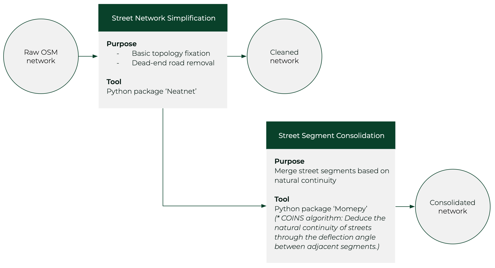{#fig-processing_neatnet}

### Variable Calculation

As aforementioned in Section 1.4, we defined four measurable variables to identify street typologies; Movement Potential, Land Surface Temperature, Distance to Green Space, and Distance to Blue Space. Each variable was calculated using the simplified network data, as described below.

#### Movement Potential

This variable measures the potential for movement within the street network. It helps identify streets that are likely to accommodate high pedestrian activity. To quantify this, we used the Angular Choice method. This method calculates how many times each street segment falls on the shortest path between all pairs of segments within a specified distance.

#### Land Surface Temperature (LST)

This variable acts as a proxy for thermal conditions of the streets. Since it was difficult to find thermal comfort index data covering the same timeframe for both cities, we used raw land surface temperature data from Landsat 8-9 Level-2 collection as an alternative to represent the spatial patterns of urban heat. To map this data to the street segments, we overlaid the street network onto the Landsat raster imagery. Each street segment was then assigned a value by calculating the mean temperature of its intersecting pixels.

#### Distance to Green Spaces

This variable acts as an indicator of potential cooling benefits by measuring the proximity of each street segment to green infrastructure. For each segment, we calculated and assigned the Euclidean distance to the nearest green infrastructure.

#### Distance to Blue Spaces

Similar to the ‘Distance to Green Space’ variable, this measures the proximity of each street segment to blue infrastructure. It was computing using the same Euclidean distance method described above.

### Data Aggregation & Standardization

#### Data Aggregation

Since each pre-consolidated street fragment was assigned four distinct variables, we needed to aggregate these values for the final consolidated street segments. First, we identified intersecting fragments by overlaying the simplified (pre-consolidated) network data onto the consolidated network data. Then, the variable values were aggregated for each corresponding consolidated street segment. The specific aggregation method varied depending on the variable; for ‘Movement Potential’, we assigned the maximum value from the overlapping fragments. For the remaining three variables, we calculated a length-weighted mean. This ensures that longer street fragments contribute proportionally more to the final aggregated values.

### Clustering & Typology Cosntruction

#### Data Standardization for Clustering

Before clustering, any missing data for the four variables were replaced with their respective means. We also applied a log transformation to the ‘Movement Potential’ variable to normalize its distribution, as its standard deviation was extremely high that may result in indistinct clusters. Next, all variables were standardized using z-scores. This step is necessary because it ensures that all variables contribute to the clustering process on a comparable scale, despite having entirely different units and numerical ranges.

#### Criteria Weighting

We applied targeted weights to each standardized variable to align with our research objective: identifying the thermal comfort levels of important urban streets. ‘Land Surface Temperature’ was assigned the highest weight of 2.0, while ‘Movement Potential’ was set to 1.0. Both ‘Distance to Green Space’ and ‘Distance to Blue Space’ were assigned the lowest weight of 0.5. By weighting these variables differently, we ensured that ‘Land Surface Temperature’ and ‘Movement Potential’ were prioritized during clustering and the resulting clusters can be more distinctive in that regard. Finally, these weights were multiplied by the standardized data to finalize the inputs for the clustering model.

#### K-means Clustering

We used the K-means clustering algorithm to group the street segments into distinct urban typologies. To find the ideal number of typologies, an Elbow Analysis evaluating the Within-Cluster Sum of Squares (WCSS) was run across a range of values (from 2 to 9). The resulting curve showed a clear inflection point (the "elbow") at $K = 4$. This proves that grouping the street network into four clusters offers the best balance, providing distinct, meaningful profiles without over-complicating the data.

### Reproducibility of Workflow

To ensure our analysis pipeline is fully reproducible, we designed an automated pipeline in RStudio. Every step, including loading data, cleaning the street networks, calculating distances, standardizing variables, and running the K-Means clustering, is handled completely by code. Important settings like the number of clusters ($K = 4$) and the variable weights are cleanly isolated. This makes it easy for anyone to audit, test, or update the analysis for a different project without relying on manual desktop GIS tools, which are prone to hidden human errors.

Our workflow strictly follows the FAIR (Findable, Accessible, Interoperable, and Reusable) data principles to support open science:

- Findable & Accessible: Our entire code repository is hosted online using GitHub Classroom. This makes our methodology transparent and fully open-source.
- Interoperable: We use open spatial data formats like GeoPackages (`.gpkg`), GeoJSONs (`.geojson`), and public Landsat GeoTIFFs. These files work seamlessly across R, Python, or regular QGIS software without requiring proprietary formats.
- Reusable: The script separates the general data processing steps from city-specific settings. This means the exact same code pipeline can be reused to analyze and map street typologies in other historic cities around the world.

## Results

### Angular Choice

The spatial configuration of pedestrian movement potential exposes deep architectural differences between the two historic cores (@fig-choice).

In Delft, the highest pedestrian choice scores map an organic, radial pathing layout. This high through-movement potential is visible along primary historic commercial corridors, Oude Langendijk for instance, stands out with a high choice score, alongside paths crossing the central Markt (Market Square). The dense street grid distributes potential movement across many parallel alleys, offering plenty of alternative routes.

In Xi'an, the movement potential is concentrated along the perimeter, where the southern outer ring road dominates the network with peak choice scores exceeding 600,000. This popular outer ring acts as a structural funnel, branching inward along strict main axes toward the center.

::: {#fig-choice layout-ncol="2"}
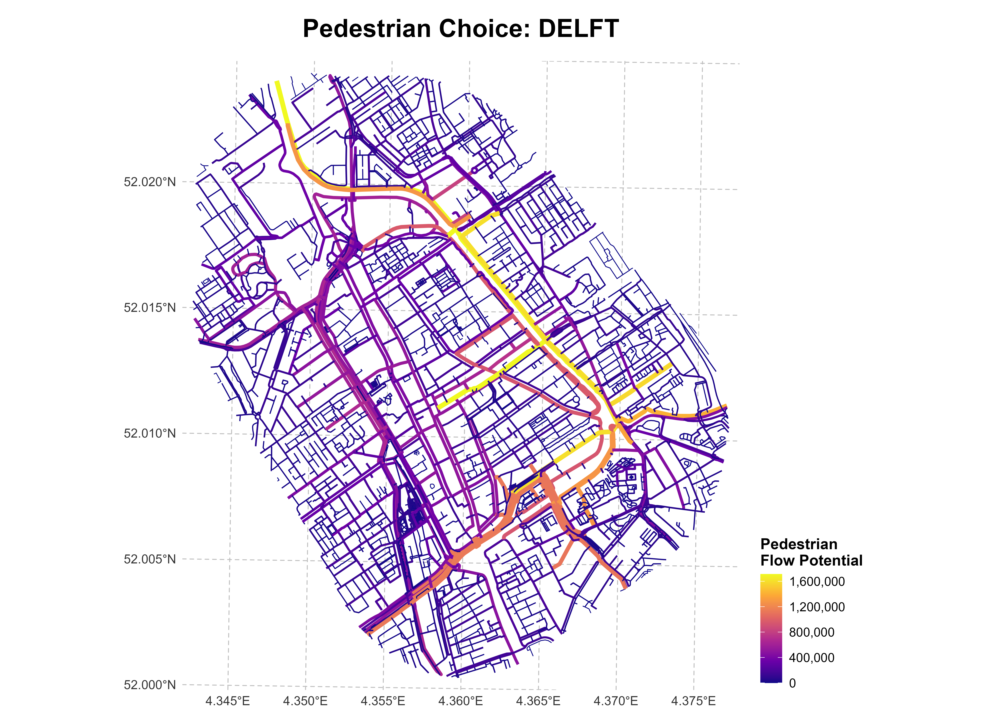{lightbox="choice"}

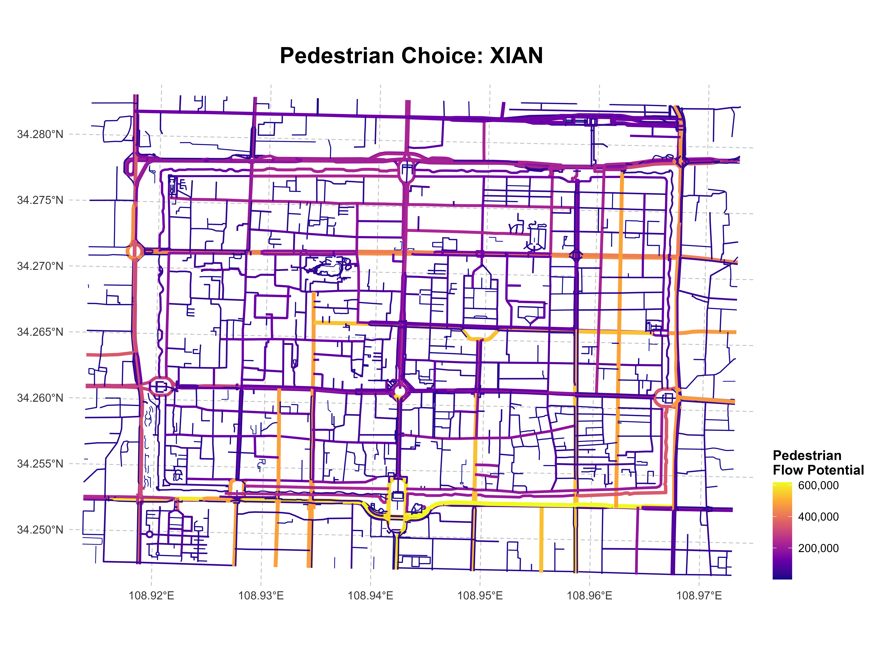{lightbox="choice"}

Map showing the Pedestrian Choice for the Historic City Centres of Delft (a) and Xi'an (b).
:::

### Surface Temperature

While LST tracks surface temperature rather than air temperature, it offers a synoptic perspective of localized heat distribution (@fig-temp). Its primary role within this workflow is to map spatial anomalies of surface heat accumulation in the urban morphology.

Delft's surface temperature map reflects a buffered maritime microclimate. Thermal hotspots are small and isolated, occurring on wide perimeter roads or large public squares like the Markt. The inner historic center remains protected due to narrow streets that maximize building shading.

Xi'an exhibits a severe, Urban Heat Island (UHI) effect. Wide asphalt corridors act as major heat sinks, driving localized surface temperatures between 38°C and 43°C. The cool anomalies inside the city walls are restricted to the continuous perimeter park and canal system parallel to the ancient ramparts.

::: {#fig-temp layout-ncol="2"}
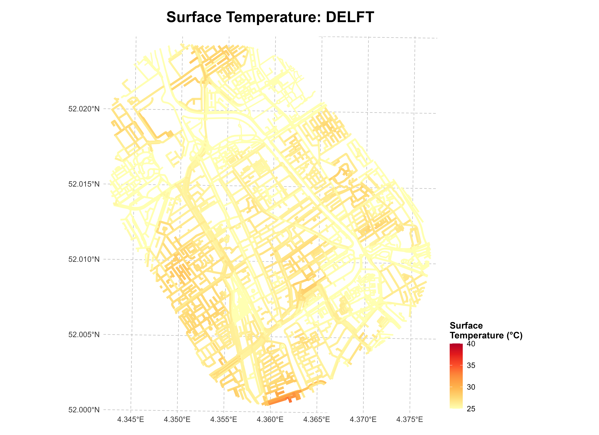{lightbox="choice"}

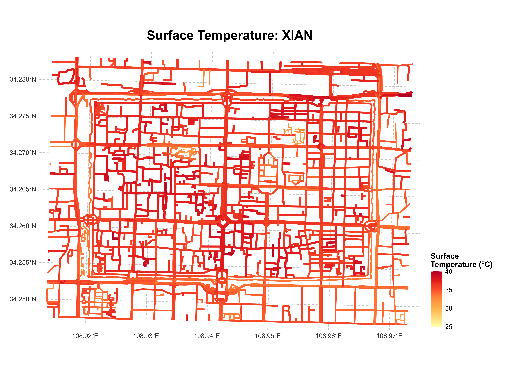{lightbox="choice"}

Map showing the Surface Temperature for the Historic City Centres of Delft (a) and Xi'an (b).
:::

### Distance to Green Spaces

Proximity to green infrastructure is modeled as the shortest Euclidean distance from the center point of each street segment to the nearest boundary edge of an OpenStreetMap designated urban park or green space (@fig-distgreen). This metric functions as an indicator of potential passive cooling benefits, as vegetated areas actively mitigate localized heat.

In Delft, proximity to green spaces is high and evenly distributed. Due to numerous pocket parks, courtyards, and tree paths, most street segments sit within a comfortable walking distance ($< 150\text{m}$) of greenery.

In Xi'an, green access is highly unequal. Streets next to the outer city walls or inner parks have immediate access to greenery. However, deep inside the commercial megablocks, streets are isolated from nature with distances exceeding $500\text{m}$, leaving these dense areas completely without vegetative cooling.

::: {#fig-distgreen layout-ncol="2"}
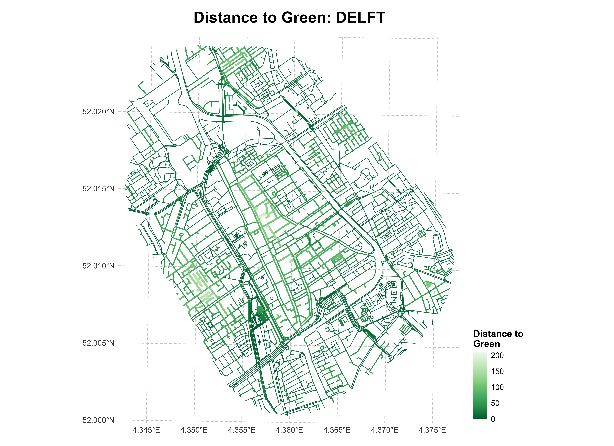{lightbox="choice"}

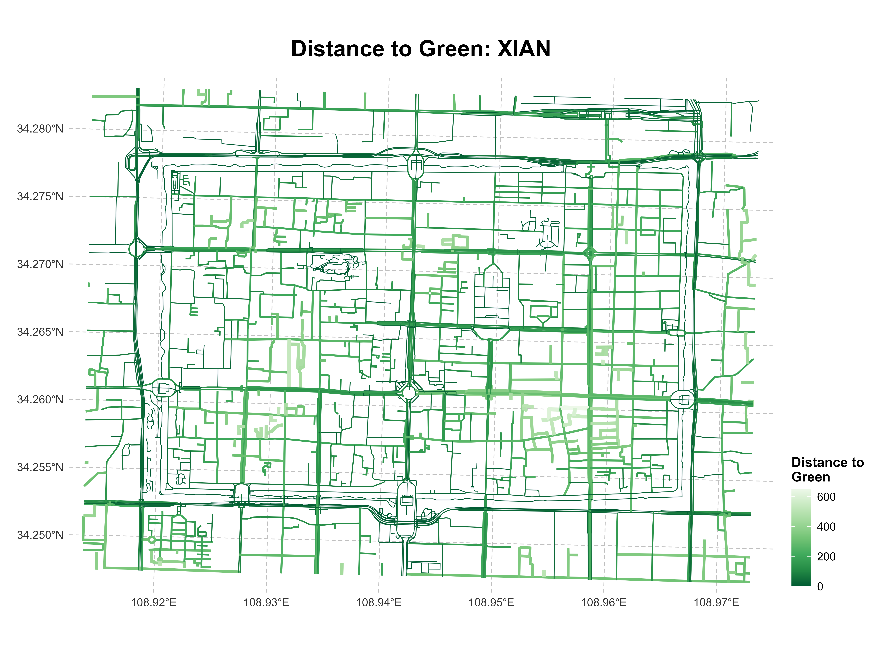{lightbox="choice"}

Map showing the Distance to Greens for the Historic City Centres of Delft (a) and Xi'an (b).
:::

### Distance to Blue Spaces

Complementing the green metric, Distance to Blue Spaces measures the Euclidean proximity of each segment to the nearest surface water body, such as canals, rivers, or lakes. Water infrastructure actively mitigates localized heat, providing vital cooling and thermal buffering within highly built-up historic urban areas.

In Delft, water access is highly uniform. Canals are deeply integrated into the street network, leaving nearly every inner core segment within $50\text{m}$ to $100\text{m}$ of water infrastructure, which provides widespread cooling potential across the network.

In Xi'an, blue infrastructure is restricted to the outer perimeter. The ancient canal system surrounds the historic core, offering excellent water proximity to streets near the city walls. However, the inner grid lacks water, meaning distances to cooling water elements increase sharply as you move toward the central Bell Tower.

::: {#fig-distblue layout-ncol="2"}
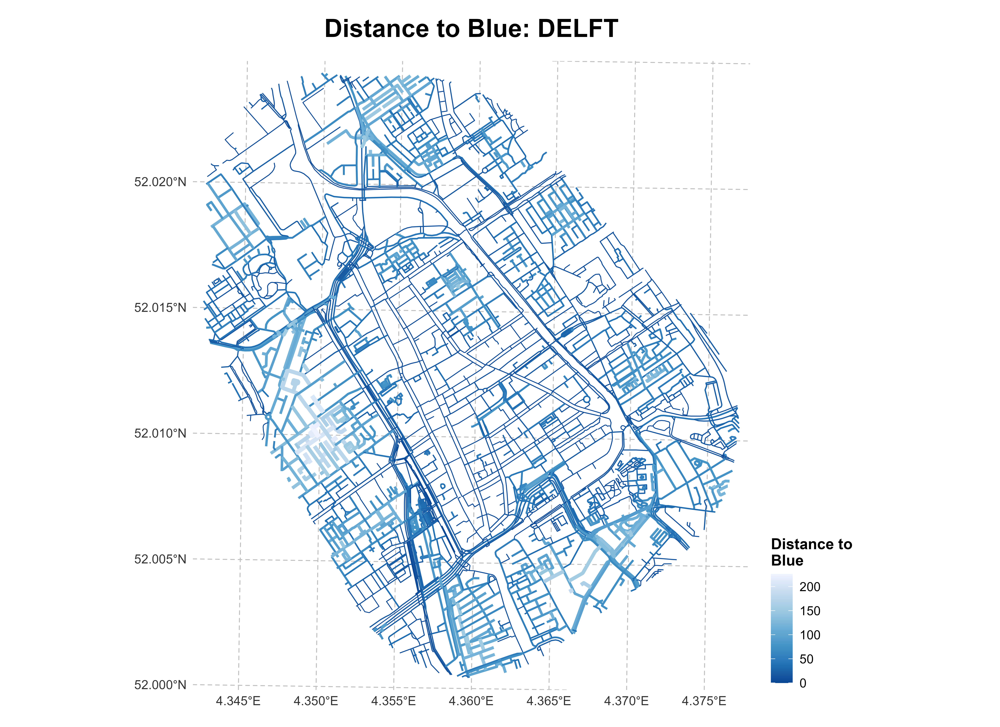{lightbox="choice"}

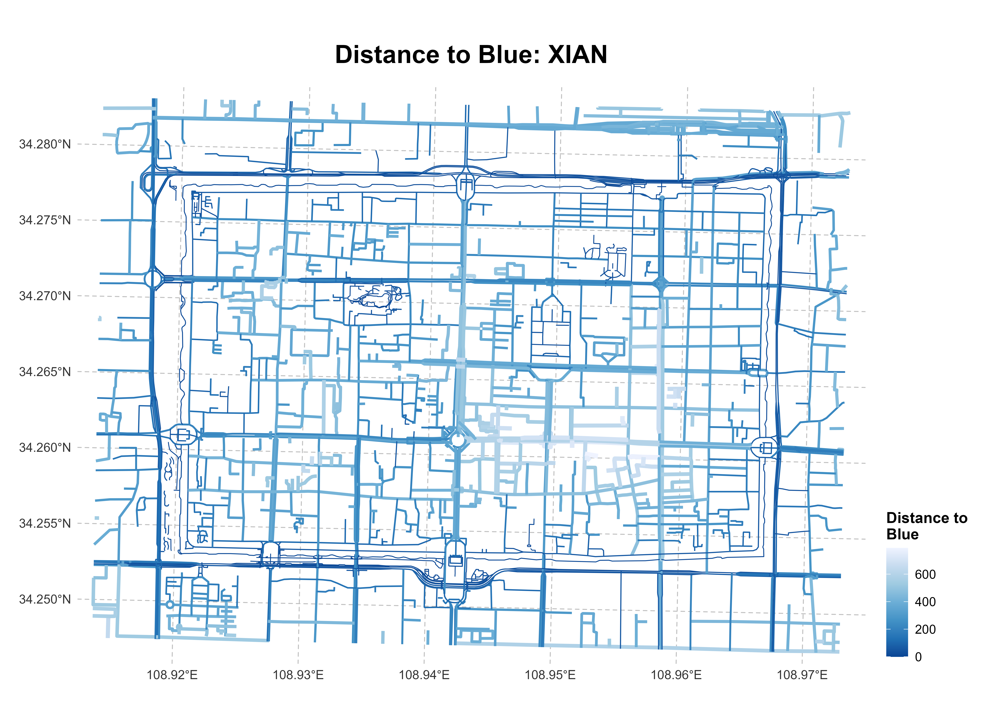{lightbox="choice"}

Map showing the Distance to Blue Network for the Historic City Centres of Delft (a) and Xi'an (b).
:::

### Summary of Indicators

While regional climates differ, with Xi'an reaching much higher peak temperatures than Delft, the overall spatial patterns are similar (@fig-clustervardistri). In both cities, wide street intersections with little vegetation consistently create matching heat and traffic bottlenecks. This shared pattern provides a clear mathematical baseline for the clustering analysis.

::: {#fig-clustervardistri layout-ncol="2"}
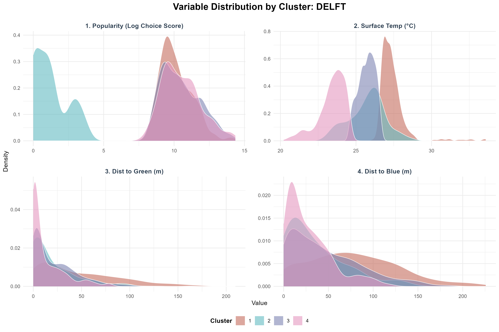{lightbox="choice"}

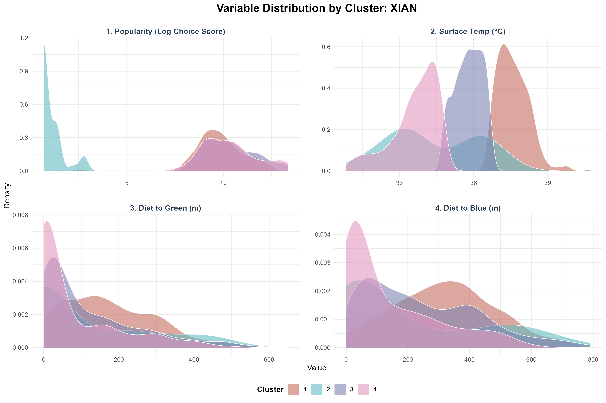{lightbox="choice"}

Graph showing the Distribution of Clusters across the Variables for the Historic City Centres of Delft (a) and Xi'an (b).
:::

### Typologies

#### Typology Construction

By plotting the average values on a parallel coordinates axis, the mathematical clusters can be translated into descriptive urban typologies. Because our manual weighting system prioritized temperature and movement potential, the algorithm identified four distinct street profiles:

| Typology | Cluster ID (Color) | Movement Potential | Surface Temp | Dist to Green | Dist to Blue | Planning Strategy |
|:----------|:---------:|:----------|:----------|:----------|:----------|:----------|
| **Typology A: Function-Driven Hotspots** | 1 (Orange) | Moderate-High | **Very High (\~37.5°C)** | High (Far) | High (Far) | **Immediate Intervention** (Cool pavements, tree planting) |
| **Typology B: Underutilized Comfort Spaces** | 2 (Green) | Very Low | **Very Cool (\~33.0°C)** | Low (Close) | Low (Close) | **Preservation / Asset Protection** (Prevent development) |
| **Typology C: Balanced Activity Spaces** | 3 (Blue) | **Highest** | Moderate-Warm | Low (Close) | Moderate | **Pedestrian Shade Infrastructure** |
| **Typology D: Comfort-Driven Hotspots** | 4 (Pink) | Low | Moderate | Moderate | Moderate | **Passive Monitoring** (Baseline fabric) |

Mapping these typologies back onto the geographic street grids exposes how these profiles materialize across different spatial layouts. In Delft, the cool *Typology B* zones are internal neighborhood networks, while *Typology D* is restricted to external vehicle bypass lines. In Xi'an, *Typology A* consumes the wide primary commercial axes, cutting straight through the core, while *Typology D* forms a protective, insulated perimeter running along the base of the city walls.

::: {#fig-clustermap layout-ncol="2"}
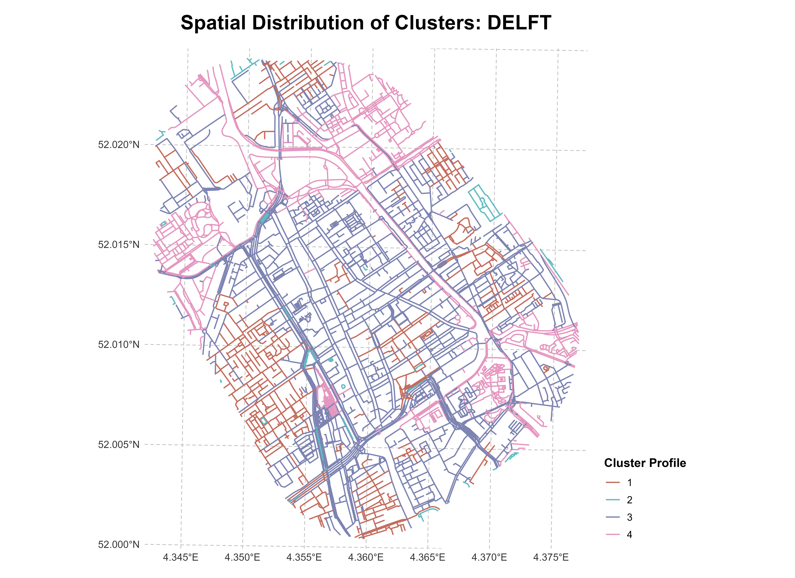{lightbox="choice"}

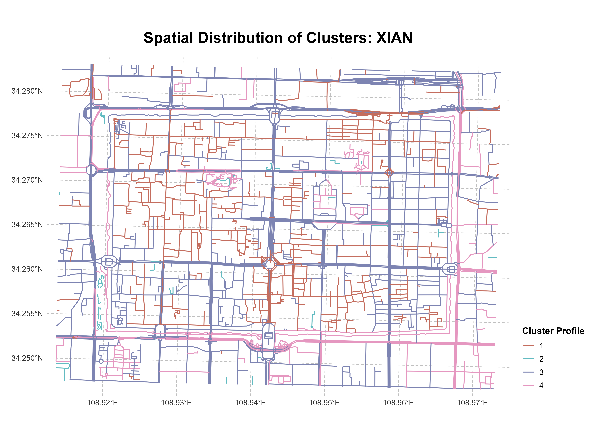{lightbox="choice"}

Maps showing the Spatial Distribution of Clusters for the Historic City Centres of Delft (a) and Xi'an (b).
:::

#### Examples of Typologies

Comparing the two cities reveals that despite major differences in urban scale and morphology, the algorithm identifies structural and environmental similarities across both street networks. By evaluating specific streets, we can observe how the same microclimatic and functional typologies present in both Delft and Xi’an.

::: {layout-ncol="2" fig-align="center"}
{lightbox="choice"}

{lightbox="choice"}
:::
Maps showing the Spatial Distribution of Clusters for the Historic City Centres of Delft (a) and Xi'an (b).

##### Typology A: Function-Driven Hotspots

Typology A marks critical problem areas where high potential pedestrian popularity directly coincides with high surface heat and low proximity to natural cooling resources.

In Delft, this functional hotspot profile matches highly active commercial streets like Koornmarkt and Molenstraat. High hardscape paving exposure creates elevated localized temperatures along these primary walking corridors.  

In Xi'an, this exact same conflict appears along dominant structural spines like Dong Er Lu (East Second Road) and Nan Dajie (Great South Street). These major avenues function identically to Delft's main streets, concentrating high numbers of pedestrians in unshaded, heat-stressed urban conditions.

::: {layout-ncol="2" fig-align="center"}
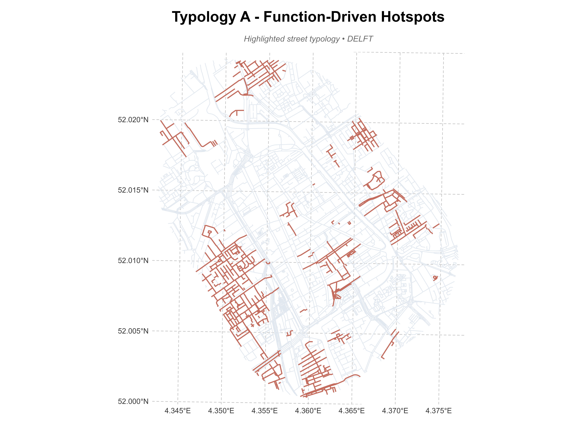{lightbox="choice"}

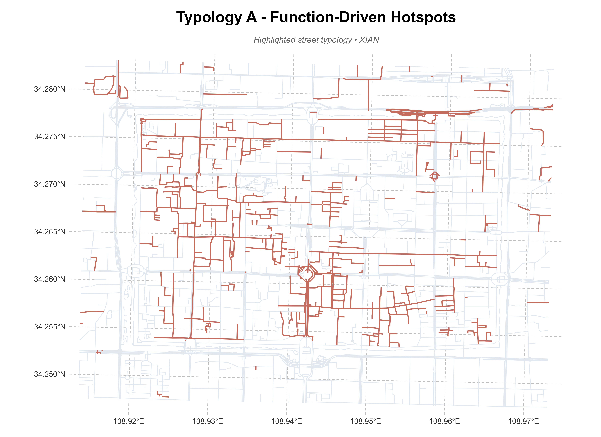{lightbox="choice"}
:::
Maps showing the Spatial Distribution of Typology A for the Historic City Centres of Delft (a) and Xi'an (b).

::::: panel-tabset
## Delft

::: {#fig-type-a-delft}
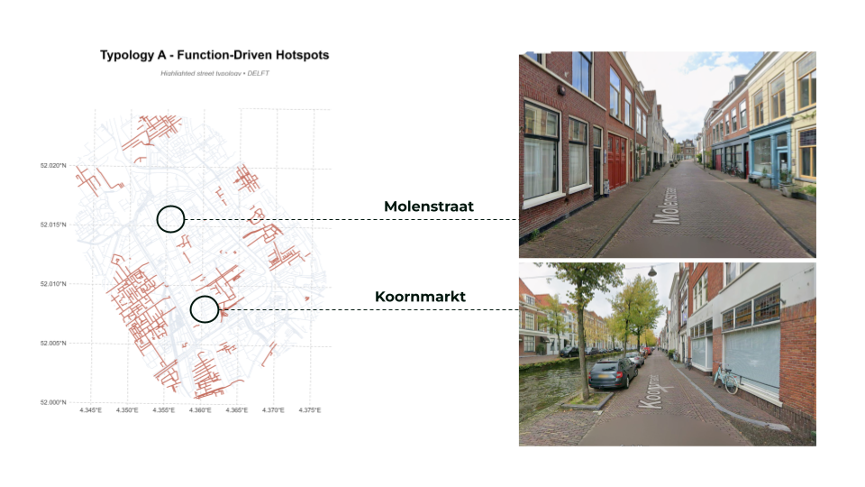{lightbox="study"}

Typology A Details for Delft (a).
:::

## Xi'an

::: {#fig-type-a-xian}
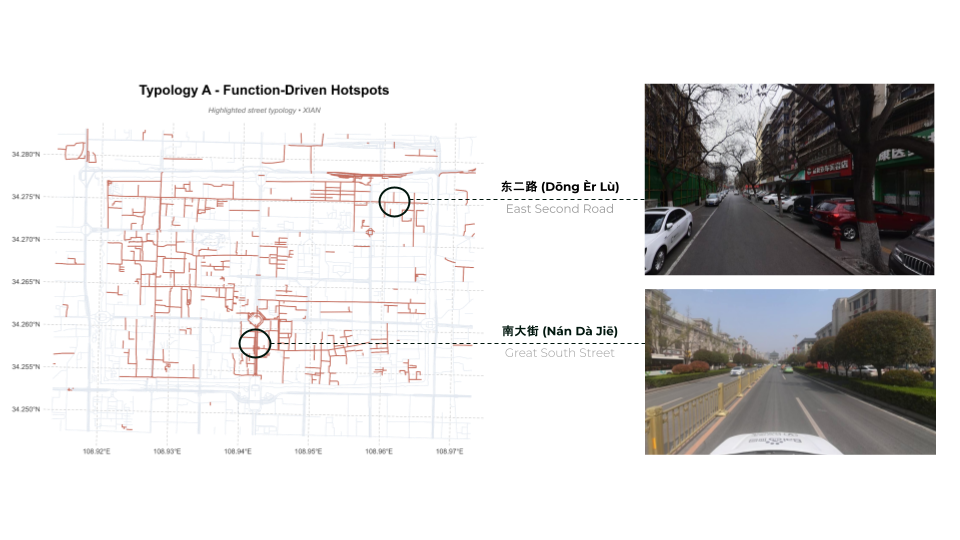{lightbox="study" width="100%"}

Typology A Details for Xi'an (b).
:::
:::::

##### Typology B: Underutilized Comfort Spaces
Typology B represents climate-resilient streets characterized by lower surface temperatures and short distances to cooling buffers, though they currently experience low potential pedestrian traffic volumes.

In Delft, this profile is typified by residential streets like Nieuwe Gracht and Oude IJsbaan. These streets are sheltered from extreme heat but do not serve as major potential paths.

In Xi'an, this identical environmental condition appears along secondary, sheltered paths like Dongxin Jie Fu Lu (East New Street Side Road) and Xianning Xue Xiang (Xianning Academy Alley). Just like their counterparts in Delft, these segments remain highly comfortable but underutilized within the broader street network.

::: {layout-ncol="2" fig-align="center"}
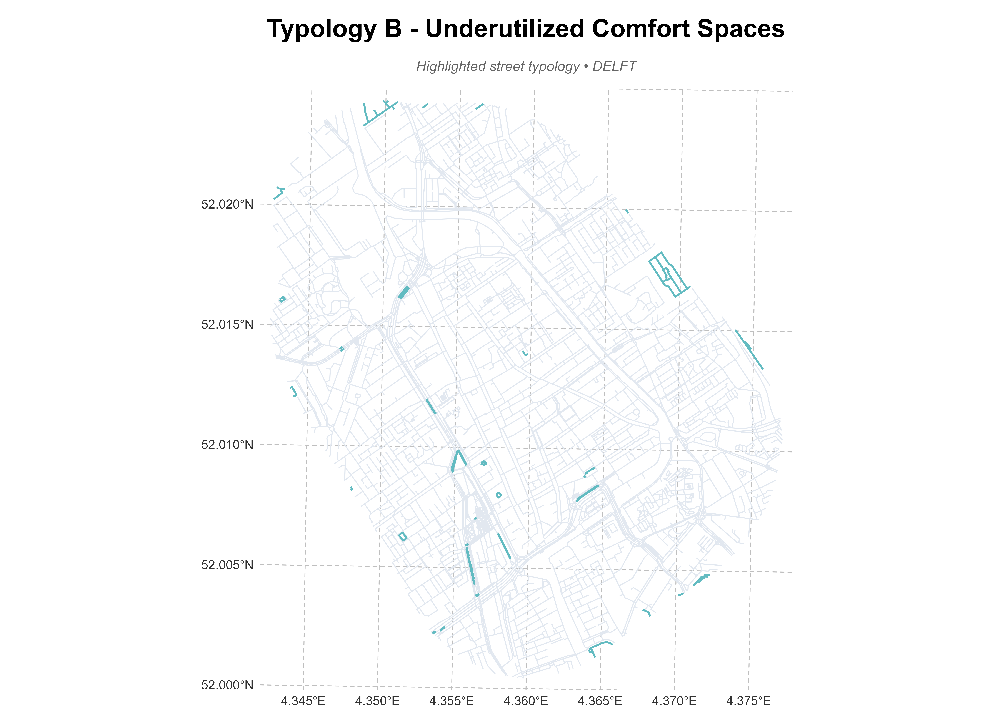{lightbox="choice"}

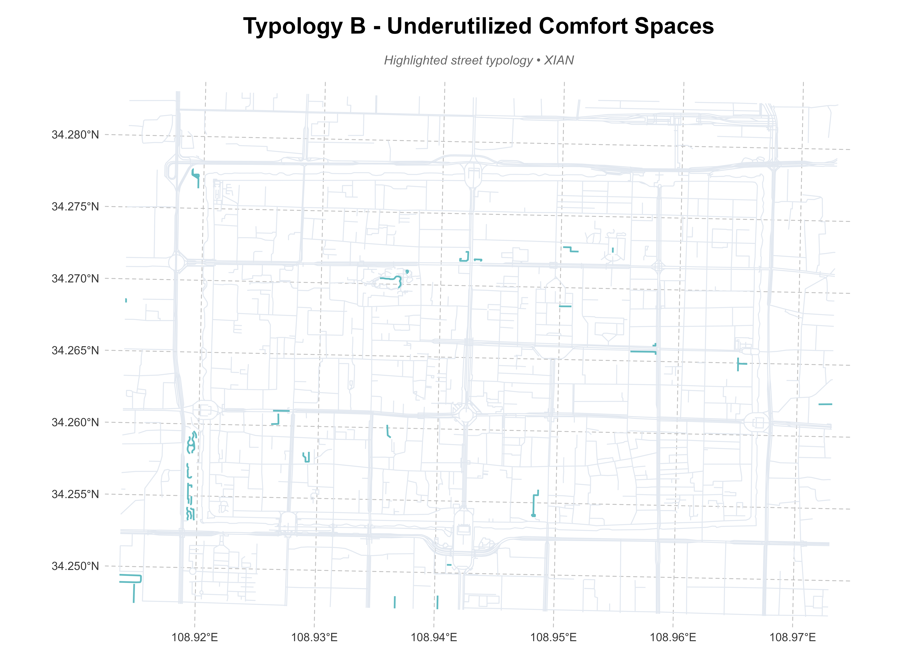{lightbox="choice"}
:::
Maps showing the Spatial Distribution of Typology B for the Historic City Centres of Delft (a) and Xi'an (b).

::::: panel-tabset
## Delft

::: {#fig-type-b-delft}
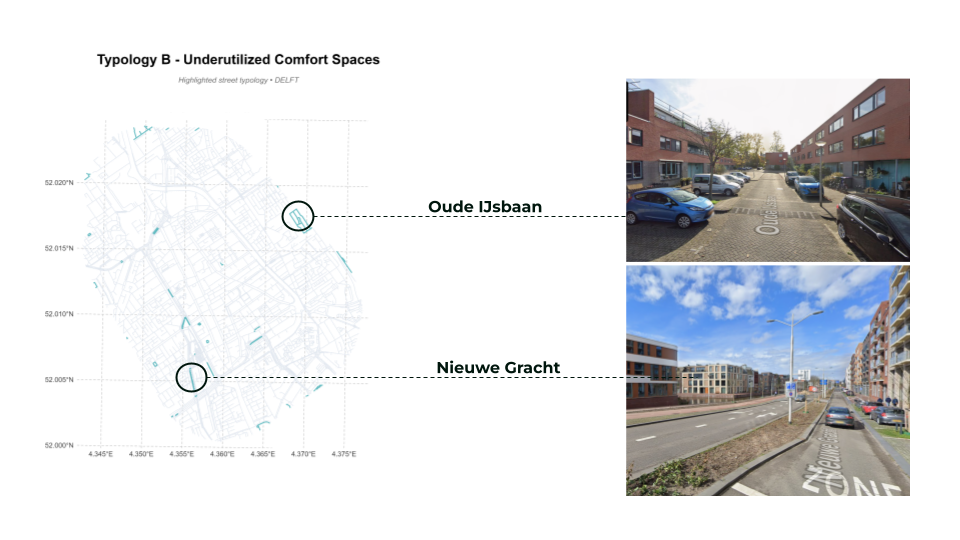{lightbox="study"}

Typology A Details for Delft (a).
:::

## Xi'an

::: {#fig-type-b-xian}
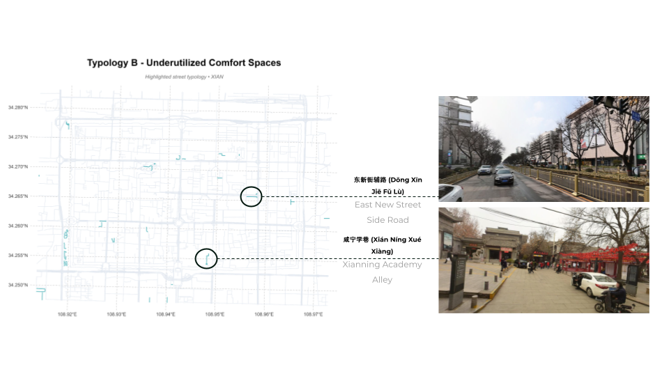{lightbox="study" width="100%"}

Typology B Details for Xi'an (b).
:::
:::::

##### Typology C: Balanced Activity Spaces
Typology C represents balanced urban environments that successfully support active pedestrian movement while maintaining close access to cooling elements.

In Delft, this profile is found on main perimeter corridors like Oostplantsoen and Westvest. These streets handle steady traffic but are buffered by immediate proximity to open green edges and canal infrastructure.

In Xi'an, this balance is mirrored along Nanlao Jie (Nanlao Street) and Shuncheng Bei Lu Xi Duan (West Section of Shuncheng North Road). Running directly parallel to the ancient wall's massive park and canal system, these streets handle significant local movement while enjoying strong, passive environmental cooling.

::: {layout-ncol="2" fig-align="center"}
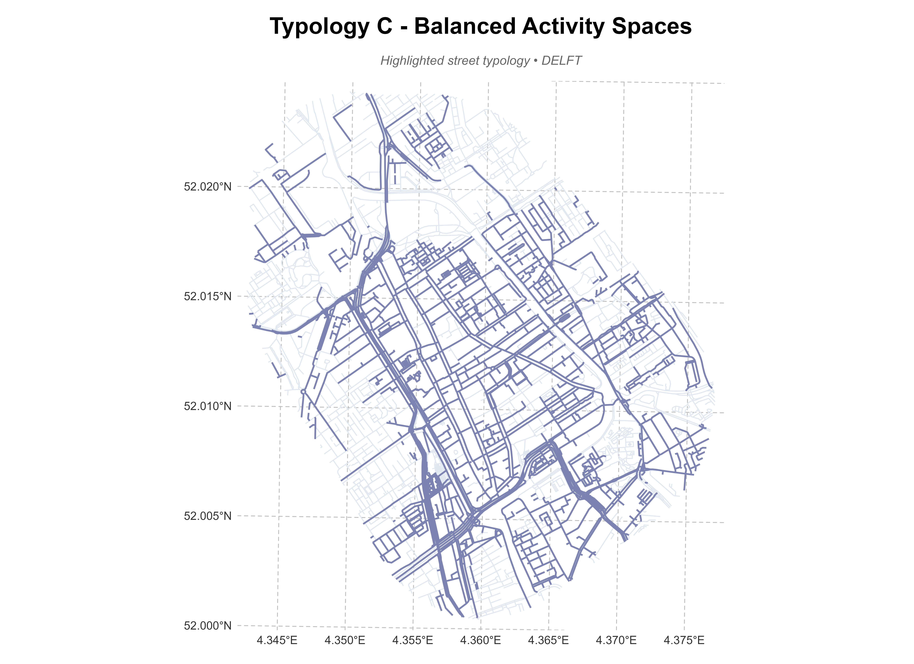{lightbox="choice"}

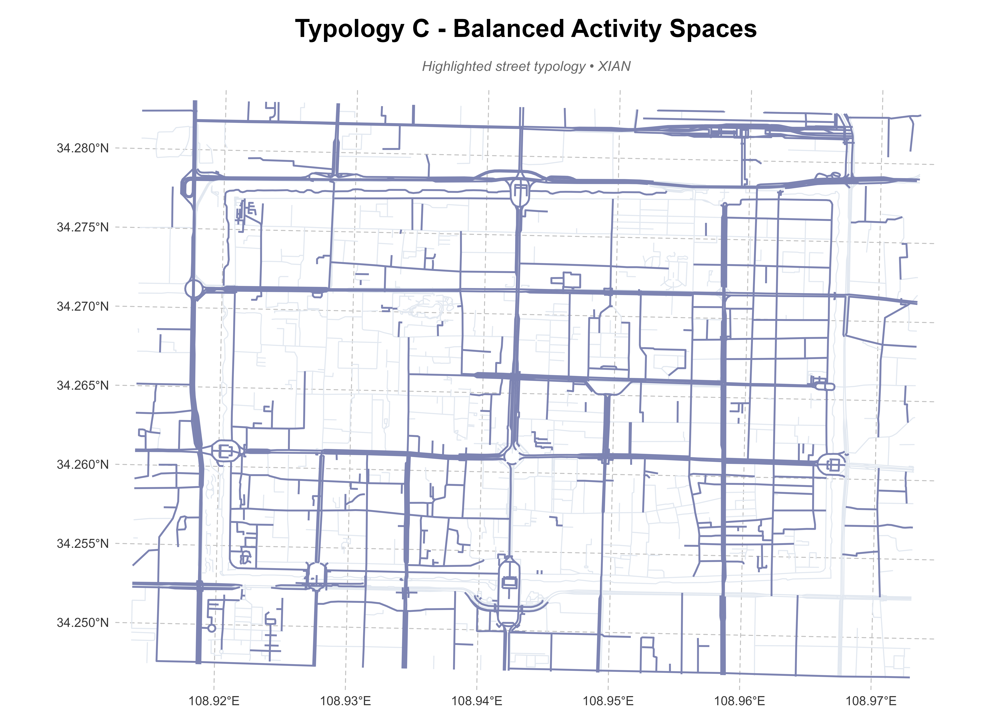{lightbox="choice"}
:::
Maps showing the Spatial Distribution of Typology C for the Historic City Centres of Delft (a) and Xi'an (b).

::::: panel-tabset
## Delft

::: {#fig-type-c-delft}
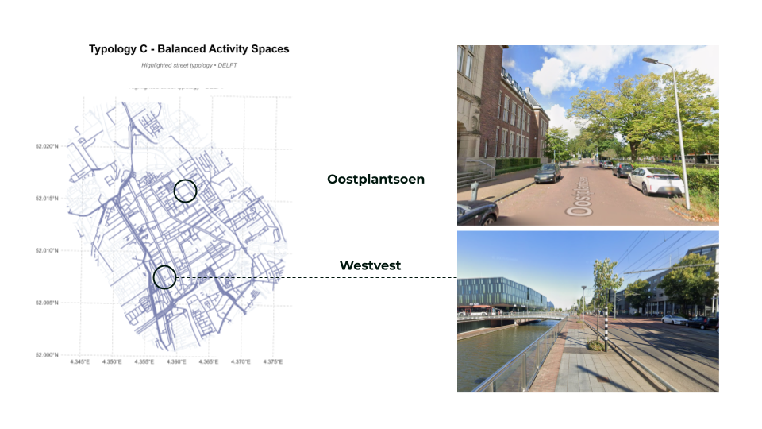{lightbox="study"}

Typology C Details for Delft (a).
:::

## Xi'an

::: {#fig-type-c-xian}
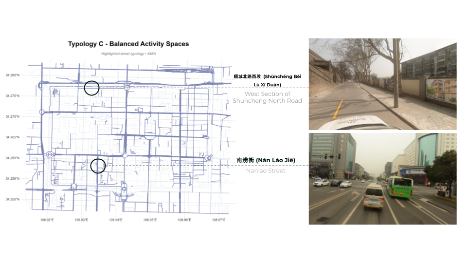{lightbox="study" width="100%"}

Typology C Details for Xi'an (b).
:::
:::::

##### Typology D: Comfort-Driven Hotspots

Typology D represents highly populated, highly active street networks that remain safe and comfortable. As verified by the density plots, while these active segments sit inside the built-up urban fabric, their temperature distributions shift distinctly to the left, capturing the lowest heat profile among all active, high-popularity clusters.

In Delft, this profile highlights high-comfort pedestrian corridors like Nieuwe Plantage and Kanaalweg. These corridors experience low temperatures and short distances to water, keeping them naturally comfortable for public activity.

In Xi'an, this trend matches comfortable corridors like Xi Wu Lu (West Fifth Road) and Shuncheng Dong Lu Nan Duan (Shuncheng East Road South Section). These streets are protected from heat stress due to shorter distances to blue-green assets, functioning as highly reliable, low-heat urban pathways.

::: {layout-ncol="2" fig-align="center"}
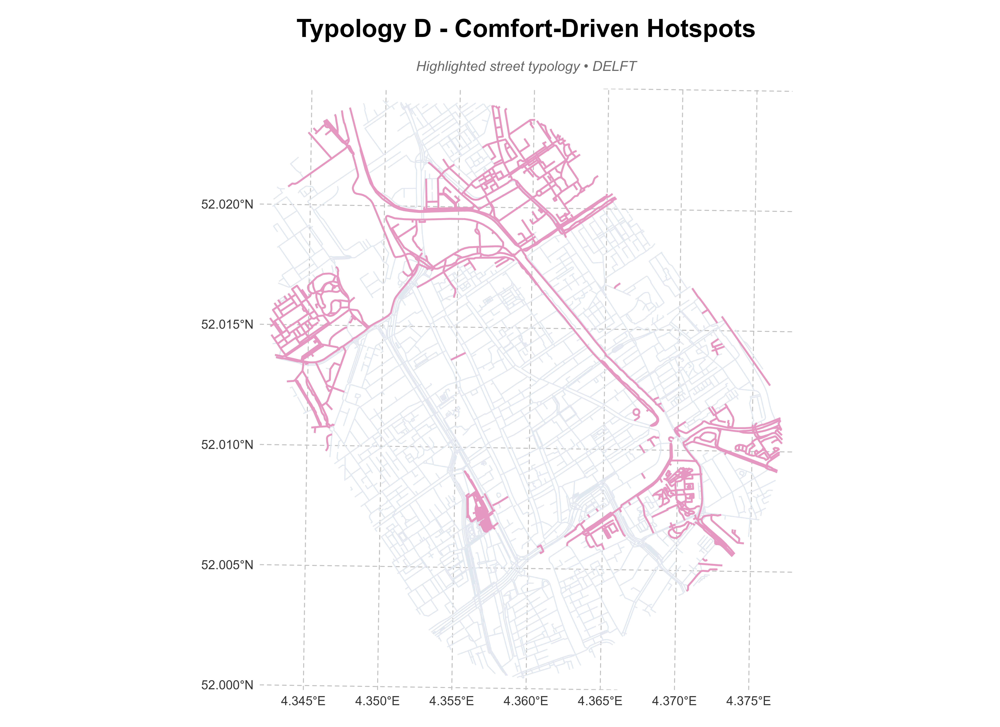{lightbox="choice"}

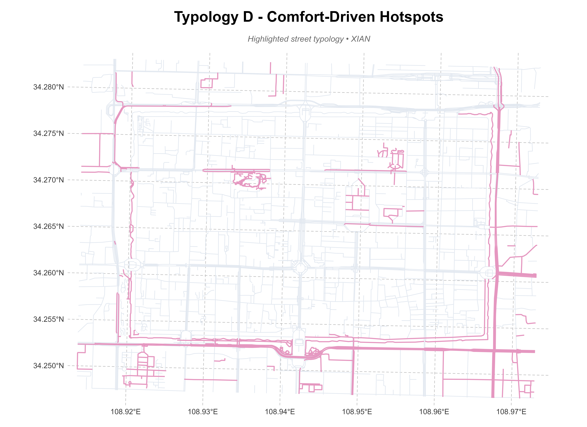{lightbox="choice"}
:::
Maps showing the Spatial Distribution of Typology D for the Historic City Centres of Delft (a) and Xi'an (b).

::::: panel-tabset
## Delft

::: {#fig-type-d-delft}
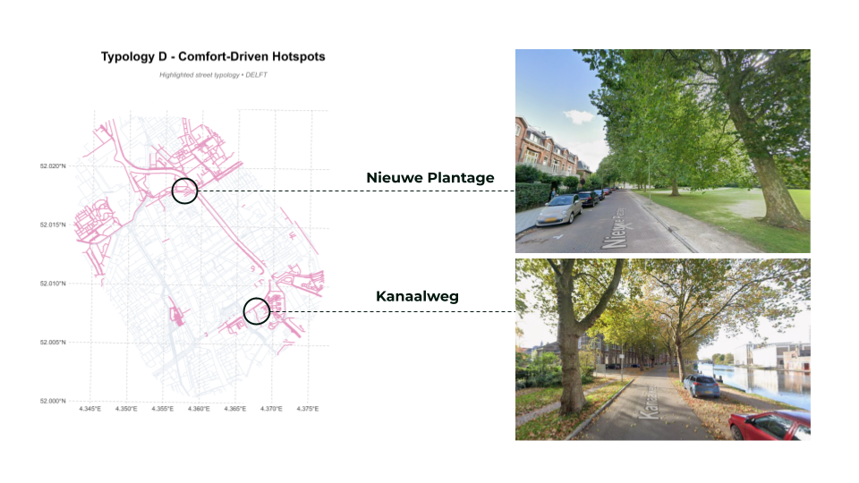{lightbox="study"}

Typology A Details for Delft (a).
:::

## Xi'an

::: {#fig-type-d-xian}
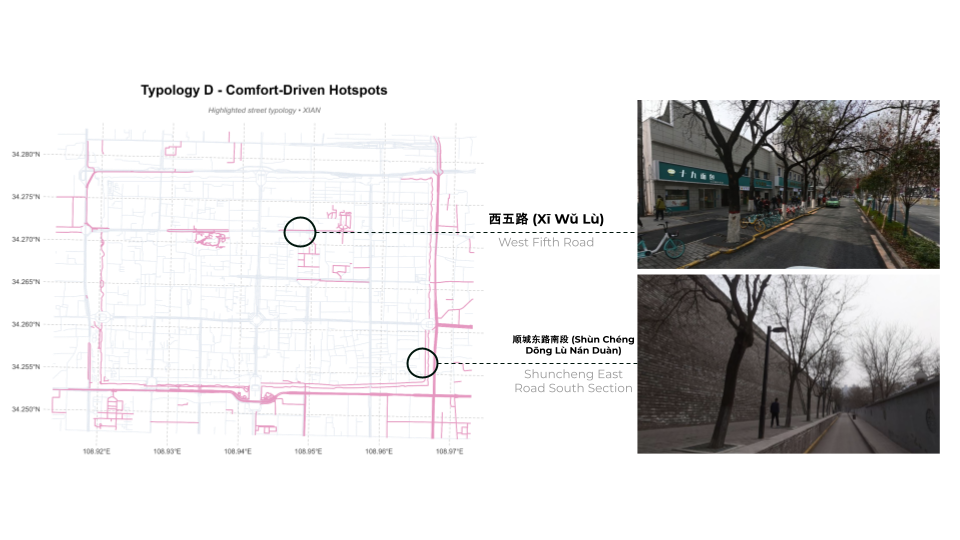{lightbox="study" width="100%"}

Typology D Details for Xi'an (b).
:::
:::::

## Discussion

### Implications

We implemented a multi-criteria decision analysis model specifically tailored for urban network thermal comfort by integrating four indicators: Movement Potential, Land Surface Temperature, Distance to Green Space, and Distance to Blue Space. This comprehensive framework allows us to categorize streets into meaningful typologies by evaluating multiple relevant factors simultaneously. Furthermore, by prioritizing thermal indices and movement potential for clustering, our method effectively identifies street segments that require urgent heat mitigation. At the same time, by incorporating distances to green and blue infrastructure, the results indicate whether the optimal strategy should focus on establishing new nearby green-blue spaces or improving existing connectivity to them.

These identified typologies offer an evidence-based foundation for climate adaptation. By suggesting which streets should be prioritized and identifying the most suitable strategies for each typology, this research offers urban planners insights for strategic decision-making. 

Finally, our analysis framework is highly reusable for comparative urban studies, particularly when study areas differ in scale. By employing a segment-based approach, the framework resolves scale-mismatch issues. In addition, the workflow is fully automated, ensuring high reproducibility; it generates comparable results across diverse urban contexts while remaining sensitive to the unique local conditions of each city.

### Limitations

As exposed in the previous sections, this research aimed to create a reproducible analysis pipeline that classifies street segments according to their thermal conditions, potential for movement, and proximity to blue-green infrastructure. However, the current methodology contains several limitations, some of them imposed by the difficulty of accessing the relevant datasets.

Firstly, LST data was used as an alternative for pedestrian thermal comfort indexes. It was not possible to obtain the latter during the data collection phase, given the difficulty of finding pre-computed thermal comfort data and, alternatively, the necessary datasets typically used in that computation. As an example, the Universal Thermal Climate Index (UTCI) demands data about air temperature, humidity, wind speed and Mean Radiance Temperature. While some of those datasets were available for Delft, they were not available for Xi’an; in order to respect the pre-established criteria of selecting datasets compatible for the two cities, the LST dataset was chosen instead. It must be noted, however, that it does not fully substitute the use of multivariable indexes for a more realistic portrayal of pedestrian thermal comfort.

Additionally, the Landsat 8-9 Level-2 grid dataset contains a spatial resolution of 30 meters; it is thus incapable of representing fine-scale variations of temperature. This specially limiting for the chosen unit of analysis, street segments, as different morphological aspects between neighboring segments may lead to significant differences in their temperature.

The angular choice method used for computing potential for movement also represents a limitation. The algorithm bases its results solely on the geometry of the networks; it does not account for any additional factor that might influence pedestrian's choice. This research did not involve supplementary studies of actual trends and behavior patterns within pedestrian transit in the two cities. Thus, it must be recognized that the potential for movement data cannot confidently reproduce the concrete conditions of pedestrian activity nor of street segment relevance within the network.

Lastly, the weight of each variable in the cluster analysis and final priority classification were defined conceptually, and not based on or influenced by stakeholders' input. In practice, the weights attributed to the variables should be adapted to reflect the actual needs and values of the involved groups. The use of different weights could potentially yield completely different results, which would require further evaluation in order to validate the meaningfulness of the classification results in each specific context.

### Further Research

There are several ways in which this study may be further developed by future research. One of them is the use of a thermal comfort index, such as UTCI or Psychologically Equivalent Temperature (PET), as the temperature-related variable. Those indexes include a broader range of phenomena that influence human perception of temperature, and thus are capable of better approximating the actual pedestrian experience with respect to heat stress.  Alternatively, higher resolution temperature data can be used to potentially capture more nuanced differences between neighboring street segments, possibly implying a different cluster characterization and classification. In a similar way, a new variable could be incorporated to the pipeline in order to represent the actual pedestrian traffic within the study areas. Methods like the integration of real-time data captured from physical sensors or by leveraging crowdsourced information from mobile network linkages can be discussed. Validating the model against observed pedestrian flows would address the limitations of using geometric computations to measure street popularity. Ultimately, incorporating such empirical data would lead to more precise and reality-based urban design interventions.

## Conclusion

This report has presented a reproducible spatial analysis pipeline that aims to answer the main research question of this study: how can thermally stressful conditions along important pedestrian streets be identified and optimized in historic city centers? In order to address this issue, the pipeline integrated distinct datasets and methods - such as angular choice and cluster classification - to identify which streets should be prioritized by decision-makers when implementing Nature Based Solutions for heat stress mitigation. This way, this study intends to contribute to an enhanced integration between data-driven studies and planning of urban interventions, with a focus on reproducibility in different contexts.

The study has shown that thermal conditions are not distributed uniformly within the study areas, and has recognized the presence of an hierarchy between different street segments with respect to their potential for movement. Additionally, it has demonstrated the difference in the morphological aspects of the two relevant city centers, those of Delft and Xi’an, related to both the configuration of their street networks and the distribution of blue and green infrastructure. Despite these differences, the methodology applied in this study yielded comparable results between the two cities - the resulting clusters showed similar characteristics, as demonstrated in Section 3.5. 

These clusters were the base to the definition of four distinct typologies, that combine the potential for movement and LST as main variables - besides distance to blue and green infrastructure as complementary variables. These topologies indicate priority for intervention, based on the principle that streets with stressful thermal conditions and higher flux of pedestrians should be prioritized, as NBS are likely to achieve greater impact in those contexts. At the same time, it is assumed that streets with higher thermal comfort should be preserved. Ultimately, this study presents a common analytical framework that, despite substantial differences in morphology and climate between cities, can support evidence-based climate adaptation in urban environments.

## Statement regarding the use of AI

OpenAi’s ChatGPT version GPT-5.5 and Google’s Gemini 3 Flash (Free tier) were utilized during the development of this project to aid in code de-bugging, algorithm optimization, and technical troubleshooting. These tools were also used to refine, format, and polish the written sections of the report to ensure academic clarity. However, all core methodology, mathematical logic, and final analysis were independently directed and verified by the authors.

## Bibliography

### Literature
